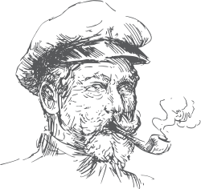

# Ahoy ye landlubbers

'tis a simple bookmarklet (or favelet if ye prefer) that scans th' current web page fer element IDs that can be used fer anchor-links.

'twas designed t' make it easier fer non-technical web editors t' link a section on a page, without havin' t' look at th' source code.

## 📦 Installation

Simply drag th' link below t' yer bookmarks toolbar. Click yer new Ahoy button t' scan th' current website.

### [Ahoy](&#x6A;&#x61;&#x76;&#x61;&#x73;&#x63;&#x72;&#x69;&#x70;&#x74;&#x3A;&#x28;&#x66;&#x75;&#x6E;&#x63;&#x74;&#x69;&#x6F;&#x6E;&#x28;&#x29;&#x7B;&#x73;&#x3D;&#x64;&#x6F;&#x63;&#x75;&#x6D;&#x65;&#x6E;&#x74;&#x2E;&#x63;&#x72;&#x65;&#x61;&#x74;&#x65;&#x45;&#x6C;&#x65;&#x6D;&#x65;&#x6E;&#x74;&#x28;&#x27;&#x73;&#x63;&#x72;&#x69;&#x70;&#x74;&#x27;&#x29;&#x3B;&#x73;&#x2E;&#x74;&#x79;&#x70;&#x65;&#x3D;&#x27;&#x74;&#x65;&#x78;&#x74;&#x2F;&#x6A;&#x61;&#x76;&#x61;&#x73;&#x63;&#x72;&#x69;&#x70;&#x74;&#x27;&#x3B;&#x73;&#x2E;&#x73;&#x72;&#x63;&#x3D;&#x27;&#x68;&#x74;&#x74;&#x70;&#x73;&#x3A;&#x2F;&#x2F;&#x72;&#x61;&#x77;&#x2E;&#x67;&#x69;&#x74;&#x68;&#x75;&#x62;&#x75;&#x73;&#x65;&#x72;&#x63;&#x6F;&#x6E;&#x74;&#x65;&#x6E;&#x74;&#x2E;&#x63;&#x6F;&#x6D;&#x2F;&#x61;&#x72;&#x6F;&#x6F;&#x64;&#x2F;&#x61;&#x68;&#x6F;&#x79;&#x2F;&#x6D;&#x61;&#x73;&#x74;&#x65;&#x72;&#x2F;&#x61;&#x68;&#x6F;&#x79;&#x2E;&#x6A;&#x73;&#x3F;&#x76;&#x3D;&#x27;&#x2B;&#x70;&#x61;&#x72;&#x73;&#x65;&#x49;&#x6E;&#x74;&#x28;&#x4D;&#x61;&#x74;&#x68;&#x2E;&#x72;&#x61;&#x6E;&#x64;&#x6F;&#x6D;&#x28;&#x29;&#x2A;&#x39;&#x39;&#x39;&#x39;&#x39;&#x39;&#x39;&#x39;&#x29;&#x3B;&#x64;&#x6F;&#x63;&#x75;&#x6D;&#x65;&#x6E;&#x74;&#x2E;&#x62;&#x6F;&#x64;&#x79;&#x2E;&#x61;&#x70;&#x70;&#x65;&#x6E;&#x64;&#x43;&#x68;&#x69;&#x6C;&#x64;&#x28;&#x73;&#x29;&#x3B;&#x7D;&#x29;&#x28;&#x29;&#x3B;)

## 📜 Author

Ahoy was developed by [Marcus Olovsson](http://marcusolovsson.com) ([@Arood](http://twitter.com/Arood))

## 📢 Acknowledgements

Vector illustrations are from [Freepik](http://freepik.com)